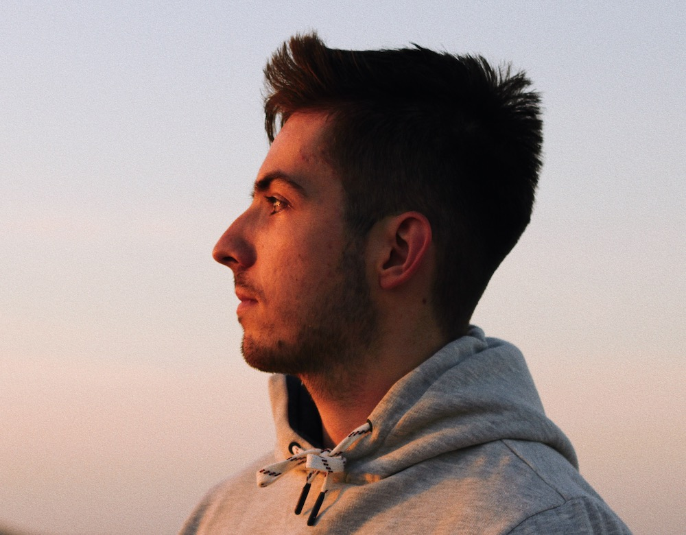

[tomas.chobola@helmholtz-muenchen.de](mailto:tomas.chobola@helmholtz-muenchen.de)

[𝕏](https://www.twitter.com/ifelsetom/) / [GitHub](https://www.github.com/ctom2/) / [Google Scholar](https://scholar.google.com/citations?user=KoL2wdQAAAAJ) / [ORCID](https://orcid.org/my-orcid?orcid=0009-0000-3272-9996) / [CV](https://drive.google.com/file/d/1aTVBHezOojjhkbr-razPECpAsJrki1T9/view?usp=sharing)


    


I am a **doctoral candidate** at the [Helmholtz Zentrum München](https://www.helmholtz-munich.de/en/computational-health-center) and [Technische Universität München](https://www.cit.tum.de/cit/startseite/), where I am researching **learnable algorithms** and methods for **computational microscopy**. My mission is to develop innovative techniques and approaches that significantly improve image quality, paving the way for advancements in bio-medical research. I am also part of [MUDS](https://www.mu-ds.de).

Prior to my doctoral studies, I completed my master's degree in Data Engineering and Analytics from Technische Universität München. Additionally, I had the opportunity to contribute to several interesting projects that involve statistical modeling, transfer learning, and privacy-preserving machine learning.

I grew up in the Czech Republic 🇨🇿 and was fortunate to spend time at The Hong Kong Polytechnic University.

---

## Featuered Projects

> [Leveraging Classic Deconvolution and Feature Extraction in Zero-Shot Image Restoration](https://arxiv.org/abs/2310.02097). Sharp microscopy image synthesis network optimised during inference, accepted to **ICCV '23** BioImage Computing Workshop.

> [A Feature-Driven Richardson-Lucy Deconvolution Network](/projects/deconvolution). Volumentric microscopy image restoration model, accepted to **MICCAI '23**.
