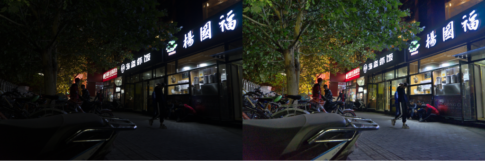

# Tomáš Chobola

**AI Scientist (PhD) / Computer Vision, Efficient ML, Self-Supervised Learning**  
[𝕏](https://x.com/ifelsetom) / [LinkedIn](https://linkedin.com/in/tchobola) / [GitHub](https://www.github.com/ctom2/) / [Google Scholar](https://scholar.google.com/citations?user=KoL2wdQAAAAJ) / 🇨🇿

---

### About Me
I am an **AI Scientist** (PhD candidate at Technical University of Munich, Helmholtz Munich) specializing in computer vision. My research focuses on solving hard, real-world problems where data is scarce and compute is limited. I build **efficient, lightweight models** for data- and compute-scarce environments, and I leverage **self-supervised** and **zero-shot learning** to create robust AI that can learn from unlabeled data and adapt to new challenges. My work has been published at top-tier conferences like ECCV, ICCV, AAAI, and MICCAI.

My most recent research involves image restoration models and training foundation models for biomedical image processing.

---

### Technical Proficiencies
* **ML skills:** Self-supervised learning, zero-shot learning, compute- and data-constrained environments, efficient ML, computer vision, image generation and restoration, large-scale and foundational vision models
* **Programming languages:** Python, C/C++, SQL, Bash
* **Libraries:** PyTorch, Scikit-Learn, NumPy, Pandas, OpenCV, Matplotlib
* **Developer Tools:** Git, HPC, LaTeX, LLM-assisted coding

---

## Featured Projects
Here are projects published at top-tier computer vision conferences.

### 1. CoLIE: Fast, Zero-Shot Low-Light Image Enhancement (ECCV'24)

> **Problem:** Enhancing low-light, high-resolution photos is computationally expensive. Current models trained on one dataset often fail on new, unseen scenes, leading to poor user experience.  

> **Solution:** I built **CoLIE**, a **zero-shot** model that enhances an image without any additional training data apart from the degraded image itself within seconds by mapping 2D image coordinates to the illumination component while working in the HSV color space, avoiding the color distortion other methods suffer from.  

> **Value:** Inference is done within a couple of seconds and is **independent of image resolution**: it's just as fast on a 4K image as a 480p one. This makes it ideal for near real-time, on-device applications and improves downstream tasks, such as object detection in the dark.

**Links:** **[Paper](https://arxiv.org/abs/2407.12511)**, **[Code](https://github.com/ctom2/colie)**, **[Online demo](https://colab.research.google.com/github/ctom2/colie)**

### 2. Noise2Detail: Ultra-Lightweight Data-Free Denoising (MICCAI'25)

> **Problem:** Most AI denoisers consist of millions of parameters, making them unusable for real-time or on-device applications like microscopes or clinical hardware. They also require massive, expensive datasets of "clean" images which are in many cases impossible to obtain.  

> **Solution:** I developed **Noise2Detail**, an "ultra-lightweight" model with only **22k parameters** that requires **zero clean training data**. The model is trained during inference using only the *single noisy input image* through a novel multi-stage refinement pipeline.  

> **Value:** The model outperforms much larger self-supervised methods while being orders of magnitude smaller and faster.

**Links:** **[Paper](https://arxiv.org/pdf/2510.15611)**, **[Code](https://github.com/ctom2/noise2detail)**, **[Online demo](https://colab.research.google.com/github/ctom2/noise2detail/blob/main/noise2detail-notebook.ipynb)**

### 3. Quantifying Privacy Risks in Medical AI (AISec 2023)

> **Problem:** AI models in high-stakes fields like healthcare are vulnerable to privacy and poisoning attacks. An attacker could "infer" if a specific patient's data was used in training (a severe privacy violation) or "poison" the model to fail.  

> **Solution:** I conducted one of the first exhaustive studies of these attacks on *semantic segmentation* models. I quantitatively benchmarked the vulnerability of popular architectures and analyzed the trade-offs of various defenses.  

> **Value:** This research identifies and quantifies critical security vulnerabilities in medical AI systems. It provides a blueprint for **trustworthy AI**, helping engineers build more robust and secure models by understanding the specific "privacy-utility trade-offs" of their design choices.

**Links:** **[Paper](https://arxiv.org/pdf/2212.01082)**, **[Code](https://github.com/ctom2/seg-mia)**

### 4. 2nd Place, AAAI 2021 MetaDL Challenge (Few-Shot Learning)

> **Problem:** How can you build a high-accuracy classifier when you only have a *few* labeled examples (1-shot or 5-shot learning)?  

> **Solution:** I developed a novel transfer-learning pipeline that **won 2nd Place at the AAAI 2021 MetaDL Challenge**. My method transforms the latent space of a pretrained network to better cluster classes and uses optimal transport mapping to better leverage *unlabeled* data.  

> **Value:** My solution in this high-pressure competition significantly outperformed baselines and models developed by numerous competitors from all around the world.

**Links:** **[Paper](http://proceedings.mlr.press/v140/chobola21a/chobola21a.pdf)**, **[Code](https://github.com/ctom2/few-shot-comp)**
